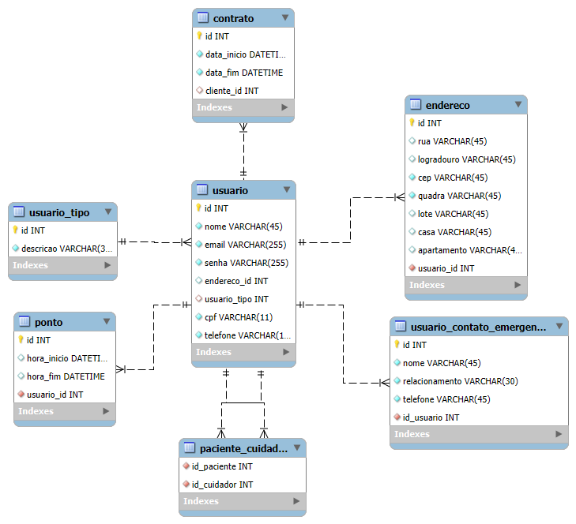

# Iniciando com MYSQL

## Ferramentas utilizadas
- _DBeaver_ (Ferramenta para gerenciar banco de dados) Outra opção -> _MySQL Workbench_.
- _Gerador de Dados falsos_ [generatedata](https://generatedata.com/generator).
- _Git_ Para versionamento de código.
- _GitHub_ Para armazenamento do repositório git na nuvem.
- _NVim_ Editor de código.
- _XAMPP_ Para servidor http e banco de dados.
- _PHP_ Linguagem utilizada no backend, juntamente com HTML para interação do usuário.
- _Bootstrap_ - Biblioteca utilizada para estilizar as páginas e manter padronização.
- _JQuery_ - Biblioteca para facilitar manipulação do DOM e requisições assíncronas.
- _Jquery.Mask_ - Biblioteca para adicionar máscara na entrada do usuário.
- _MySQL Workbench_ - Utilizado para criar o modelo do banco de dados.

## Funcionalidades/Escopo

  
Usuário

  - Criação de usuário, cada usuário pode assumir 3 papéis:
  -  cliente (que é o padrão).
  -  administrador (que deve ser incluído por um administrador do banco de dados).
  -  cuidador (que deve ser incluído e gerido por um administrador do sistema WEB).
  - Criação/Atualização de contatos de emergência, visam fornecer aos administradores e cuidadores um contato de confiança caso algo ocorra com um cliente.
  - Cadastro de endereço pelo CEP.
  - Relacionamento de Paciente x Cuidador, a ser registrado pelo administrador.

Contratos

- Criação de contratos, apenas por administradores.

Ponto

- Cuidadores poderão registrar o horário de entrada e saída para trabalharem.

## Diagrama do Banco de Dados

## Trechos importantes de código

  
Conexão com DB

  
Controle de Acesso

  
Modularização de Componentes

  
Uso de sessão

## Considerações finais